# Vira AI Service Architecture (PoC)

## Purpose

The PoC builds a trustworthy creator-style profile from a small, fixed evidence set, and a brand-side `BrandProfile` counterpart, to support hybrid creator-brand matching (vector similarity for semantic fit + a rule-based score contract for hard constraints) (ADR-010).

## Architecture diagram



## System boundary

```text
TikTok Videos (3) + Raw TikTok Data + Creator Quiz
                       |
                       v
                 Video Analyzer
                       |
                       v
               VideoAnalytics[]
                       |
                       v
           Creator Profile Generator
                       |
                       v
                 CreatorProfile
```

## Components

### 1. Input package

The input package contains exactly three video assets/references, TikTok metadata captured for each video, and creator-supplied quiz answers. It assigns stable IDs and preserves source payloads unchanged.

### 2. Video Analyzer

The analyzer processes one video at a time. It combines the video with its corresponding raw metadata and produces a `VideoAnalytics` record containing:

- evidence-backed observations about the video;
- bounded style/content inferences;
- confidence and evidence references;
- no cross-video conclusions.

The analyzer uses the versioned instruction in `prompts/` — one file per prompt version (e.g.
`prompts/video-analyzer-v3.md`), named after `VIDEO_ANALYZER_PROMPT_VERSION`. See
`docs/backend-integration.md` for how that maps to stored analyzer output.

### 3. Creator Profile Generator

The generator receives all three `VideoAnalytics` records, raw TikTok metadata, and the quiz. It identifies repeated patterns, preserves conflicts conservatively, and creates a `CreatorProfile`. It never receives video assets or performs video understanding. It must not treat a one-video observation as a stable creator trait without appropriate confidence.

## Data principles

- **Traceability:** every analytical claim links back to a video, raw field, quiz answer, or multiple analytics IDs.
- **Separation:** raw data, observations, and inferences remain distinct.
- **Uncertainty:** absence of evidence is represented explicitly.
- **Versioning:** input/output contracts and prompts carry versions.
- **Replaceability:** analysis model/provider is an adapter concern; contracts do not depend on a vendor.

## Non-goals

This architecture does not yet include user accounts, ingestion jobs, storage selection, UI, human review queues, persisted matching/ranking results, campaign execution, or TikTok publishing. `BrandProfile` and on-demand vector-similarity matching are in scope (ADR-010).
